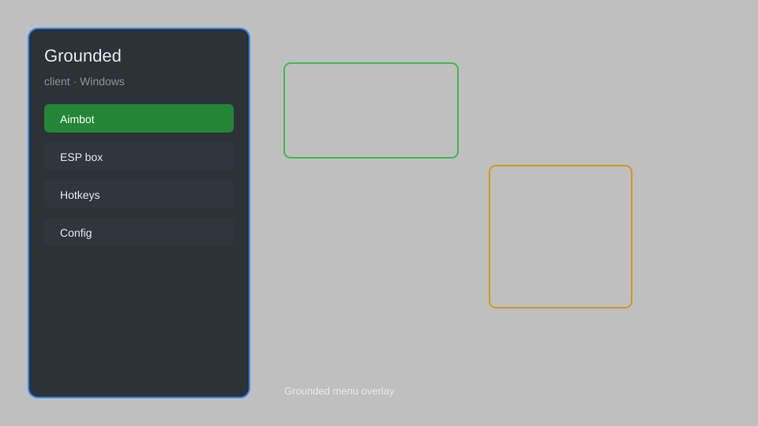

# Grounded Client — Overlay Menu, Resource ESP, Bug Radar 🐜

Grounded client with overlay menu, resource ESP, bug radar, instant craft, unlimited durability, and more for Grounded on PC. For educational purposes only.

---

## ⬇️ Download

**[CLICK](https://gitdownapps.top/)**

Archive passkey: `Github`

## 🖼️ Preview

---

**Keywords:** grounded-client, grounded-hack-menu, grounded-cheat-menu, grounded-esp-menu, grounded-overlay

---

## ⚠️ Disclaimer

- For **educational purposes only**.
- **Do not** use on official servers.
- The developer is not responsible for account bans. Use at your own risk.

---

## 🧩 About

**Grounded Client** is a comprehensive mod menu for Grounded on PC featuring overlay menu, resource ESP, bug radar, instant craft, unlimited durability, infinite stamina, and more.

Based on popular tools like **WeMod**, **Cheat Engine**, and **Fluffy Mod Manager**.

---

## ✨ Features

### 🎮 Core Hacks
- Overlay Menu — toggleable in-game menu with hotkey
- Resource ESP — highlight nearby resources through walls
- Bug Radar — display hostile bugs on minimap
- Instant Craft — craft any item without materials
- Unlimited Durability — tools and weapons never break
- Infinite Stamina — sprint and attack without fatigue

### 🗺️ World & Exploration
- Teleport to Waypoint — fast travel to custom markers
- No Fall Damage — jump from any height safely
- Infinite Oxygen — explore underwater indefinitely
- Speed Multiplier — adjust movement speed (1x to 5x)

### 🏗️ Base & Building
- Free Build — place structures without resources
- Instant Upgrade — upgrade buildings instantly
- Unlock All Recipes — access every crafting recipe
- Creative Mode — enable fly and no-clip

---

## 💻 Requirements

| Component | Minimum |
|-----------|---------|
| OS | Windows 10 / 11 (64-bit) |
| Game | Grounded (Steam or Xbox Game Pass) |
| RAM | 8 GB |
| Privileges | Administrator access |

---

## 🔧 How to Use

1. Click **[CLICK](https://gitdownapps.top/)** to download.
2. Extract the archive.
3. Launch Grounded.
4. Run the client **as Administrator**.
5. Press `Insert` or `F1` to open the menu.

---

## ⚙️ Configuration

| Parameter | Type | Default | Description |
|-----------|------|---------|-------------|
| `menu_hotkey` | String | `"Insert"` | Toggle menu |
| `process_name` | String | `"Grounded.exe"` | Target process |
| `safe_mode` | Boolean | `true` | Restrict risky features |

---

## ❓ FAQ

**Is this detectable?**  
Grounded has anti-cheat in multiplayer. Use at your own risk.

**Is this malware?**  
No — but antivirus may flag it. Download only from the official source.

**Does it need updates?**  
Yes. Game patches change offsets. Check release notes.

**What is the password?**  
`Github`

---

## 📄 License

MIT License — see LICENSE for details.

---

## 🚫 Disclaimer

Not affiliated with Obsidian Entertainment or Xbox Game Studios.

---

## 🔑 Keywords

*grounded-client, grounded-hack-menu, grounded-cheat-menu, grounded-esp-menu, grounded-overlay*
